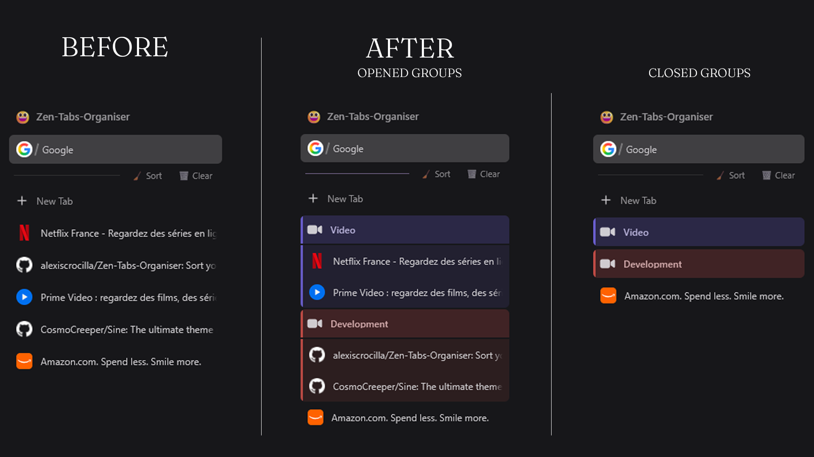

# Zen Tabs Organiser

Turn a crowded vertical tab sidebar into clear, color-coded tab groups with one click. Zen Tabs Organiser can sort locally by domain, use Firefox's on-device AI, or connect to your preferred AI provider.

Runs on **Zen Browser** and on **Firefox** with vertical tabs.

<p align="center">
  
</p>

## Why use it?
- **One-click sorting** into meaningful tab groups
- **Private by default** with domain-based grouping and no network requests
- **On-device AI** through Firefox's own Smart Tab Grouping models
- **Automatic colors and icons** that persist across browser restarts
- **Workspace-aware behavior** that only touches the active workspace (on Zen)
- **Safe around browser features**: pinned tabs, Zen folders, and split views are left alone
- **Quick cleanup** of loose tabs with the **Clear** button

## Requirements
- [Zen Browser](https://zen-browser.app/) 1.21+, or [Firefox](https://www.mozilla.org/firefox/) with tab groups and vertical tabs — developed and checked against **Firefox 156** and **Zen 1.22**. Older Firefox releases are expected to work, but some group icons resolve to chrome paths that only exist in recent builds and will fall back to a generic folder icon.
- [Sine](https://github.com/CosmoCreeper/Sine), the community mod manager for Zen and Firefox-based browsers

> [!NOTE]
> This is a Sine mod because its sorting logic requires JavaScript. Zen's native Mods Registry only loads CSS and preferences.

### On Firefox
Turn on vertical tabs first — right-click the tab strip and choose *Turn on Vertical Tabs*, or set **Browser layout → Vertical tabs** in Settings (under **Tabs and browsing** on Firefox 156+, under **General** on older builds). The **Sort** and **Clear** buttons appear in a row under the pinned tabs, the same place they occupy on Zen.

The expanded vertical sidebar is the layout this mod is designed for, and the only one it restyles. In the horizontal strip and in a collapsed sidebar it leaves Firefox's own tab-group appearance untouched rather than half-replacing it, and the buttons are not shown — there is nowhere sensible for them there.

Two Zen-only touches have no Firefox equivalent and stand down there:

| Feature | Zen | Firefox |
|---------|-----|---------|
| Workspaces | Sort and Clear act on the active workspace only | Acts on the window's tab strip |
| Show Sort / Show Clear | Hide either button | Not available — the media feature these use (`-moz-bool-pref`) is added by Zen and does not exist in Firefox, so both buttons are always shown |
| Group right-click | Zen's folder menu: rename, pick an icon | Firefox's own group editor: rename, recolor |
| Group color picked by hand | Not offered | Honored — the mod stops re-coloring that group |

## Installation
Open `about:preferences#sineMods`, then choose one of the following methods:

### Sine store
Search for **Zen Tabs Organiser** in the Sine marketplace and select **Install**.

### GitHub repository
1. In Sine's settings, enable **Install JS from unofficial sources** (`sine.allow-unsafe-js`).
2. Under **Installation**, find **Add your own locally from a GitHub repo**.
3. Paste the repository identifier:

   ```
   alexiscrocilla/Zen-Tabs-Organiser
   ```

4. Select **Install**.

If the unsafe-JS option is disabled, Sine may load the styles but silently skip the script, so the **Sort** and **Clear** buttons will not appear.

## Quick Start
1. Open several tabs in the same Zen workspace.
2. Select **Sort** in the sidebar.
3. Expand or collapse the generated groups as needed.
4. Select **Clear** to close loose, unpinned tabs in the active workspace.

When multiple tabs are selected, **Sort** processes only that selection. Otherwise, it sorts loose eligible tabs in the active workspace and leaves existing groups unchanged.

## Grouping Modes
Configure the mod from `about:preferences#sineMods` → **Zen Tabs Organiser** → **Settings**.

| Provider | Data handling | API key | Default model |
|----------|---------------|---------|---------------|
| None | Groups locally by keywords and domains | No | Not applicable |
| Local - Firefox AI | Runs Firefox's Smart Tab Grouping models on device | No | Mozilla-provided models |
| Gemini | Sends tab titles and URLs to Google | Yes | `gemini-2.0-flash` |
| Ollama | Sends tab titles and URLs to your configured Ollama endpoint | No | `llama3.2` |
| Mistral | Sends tab titles and URLs to Mistral | Yes | `mistral-small-latest` |
| OpenAI | Sends tab titles and URLs to OpenAI or a compatible endpoint | Yes | `gpt-4o-mini` |

### Private local AI
Choose **Local - Firefox AI, no API key** to group tabs by meaning without sending tab data to a cloud provider. Firefox downloads the required models on the first run, so the initial sort can take longer.

The mod enables `browser.ml.enable` when this provider is selected. If local AI is unavailable or cannot form groups, sorting falls back to local domain-based grouping.

### Cloud or self-hosted AI
Choose a provider, enter its API key when required, and optionally override the model or endpoint. Settings are read each time you select **Sort**, so changes apply without restarting Zen.

## Settings
| Setting | Default | Description |
|---------|---------|-------------|
| Show Sort button | On | Displays the sidebar sorting action |
| Show Clear button | On | Displays the loose-tab cleanup action |
| Auto-assign colors | On | Gives each group a persistent color |
| Auto-assign icons | On | Adds a contextual icon to each group |
| Minimum tabs per group | `2` | Prevents undersized groups from being created |
| AI provider | None | Selects local, on-device, cloud, or self-hosted grouping |
| API key | Empty | Used by Gemini, Mistral, and OpenAI |
| Model | Provider default | Overrides the provider's default model |
| Endpoint | Provider default | Overrides the Ollama or OpenAI-compatible endpoint |

## Behavior and Privacy
- Full-workspace **Sort** ignores pinned tabs, existing groups, Zen folders, split views, empty tabs, and browser-internal pages.
- Existing groups are never changed by **Sort**; loose tabs that receive an existing group's label are placed in a new numbered group.
- Right-click a group header to rename it or choose a custom icon using Zen's native folder menu.
- **Clear** keeps the selected tab, pinned tabs, grouped tabs, folder tabs, and split-view tabs.
- Only tabs in the active workspace are sorted or cleared.
- With **None** or **Local - Firefox AI**, tab titles and URLs do not leave the browser.
- With a cloud or self-hosted provider, tab titles and URLs are sent to the endpoint you configure.

## Troubleshooting
### The buttons do not appear
Confirm that Sine is installed and that `sine.allow-unsafe-js` is enabled for repository installations. Then disable and re-enable the mod in Sine.

### The first local-AI sort is slow
Firefox downloads its Smart Tab Grouping models on first use. Later sorts reuse the downloaded models.

### The buttons do not appear on Firefox
The buttons need vertical tabs: right-click the tab strip and choose *Turn on Vertical Tabs*. The browser console logs a reminder when the mod loads with a horizontal strip.

### Group styles conflict with another mod
Zen Tabs Organiser styles groups independently. Another mod that changes tab-group colors, icons, or geometry can produce conflicting results; disable one of the overlapping group-style mods.

## Development
Clone the repository and install the local checkout through Sine while developing:

```bash
git clone https://github.com/alexiscrocilla/Zen-Tabs-Organiser.git
```

| File | Purpose |
|------|---------|
| `theme.json` | Sine manifest and mod metadata |
| `zen-tabs-organiser.uc.js` | Sorting, grouping, persistence, and cleanup logic |
| `chrome.css` | Sidebar controls, group styling, and animations |
| `preferences.json` | Settings schema displayed by Sine |

Sine injects the `.uc.js` script into `chrome://browser/content/browser.xhtml`. Keep runtime behavior in the script, visual rules in `chrome.css`, and ensure every added listener, observer, timer, or DOM node is removed by the unload handler.

The browser differences are collected in one place each: `isZen()`, `activeWorkspaceId()`, `inActiveScope()`, `workspacesNotReady()` and `scopedGroupSelector()` in the script, and the `FIREFOX` section of `chrome.css`. Detection is by DOM (`commandset#zenCommandSet`), never by user agent. Every rule in that section is guarded with `:not(:has(> .tab-group-container))`, a child only Zen's patched tab groups have, so a Zen window can never match them.

Two rules of thumb learned the hard way, both worth keeping:
- **Do not measure a value the stylesheet itself writes.** An earlier version read a tab's inline inset off `getComputedStyle` and republished it; the Firefox rules zero that same margin inside a group, so after the first sort the measurement fed on its own output. Each browser already names the value in a variable — read that.
- **`activeWorkspaceId()` returning null does not mean "no workspaces".** On Zen it also means "workspaces exist but none is chosen yet", which is the state of every window at startup. Guard with `workspacesNotReady()` before acting window-wide, or Clear will close tabs across every space.

## Contributing
Bug reports and focused pull requests are welcome. Before opening a pull request:
1. Test sorting with no AI provider and with any provider affected by your change.
2. Verify both full-workspace and multi-selected-tab sorting.
3. Confirm that pinned tabs, folders, split views, and inactive workspaces remain untouched.
4. Toggle the mod off and on without restarting the browser to verify cleanup and reinjection.
5. Check the change on **both** Zen and Firefox with vertical tabs. The group markup differs between them — Firefox keeps the tabs as direct children of `<tab-group>` and wraps the label in `.tab-group-label-hover-highlight`, Zen puts the tabs in a `.tab-group-container` and hoists the label — and `chrome.css` carries a separate, guarded section for each.

## Migrating from the Zen Mod Format
Older releases used `mod.json`, `chrome.js`, and `style.css`. Remove the old version from Zen's Mods Registry before installing the Sine version to prevent duplicate controls. Existing preference names are unchanged.

## License
Licensed under the [MIT License](LICENSE).